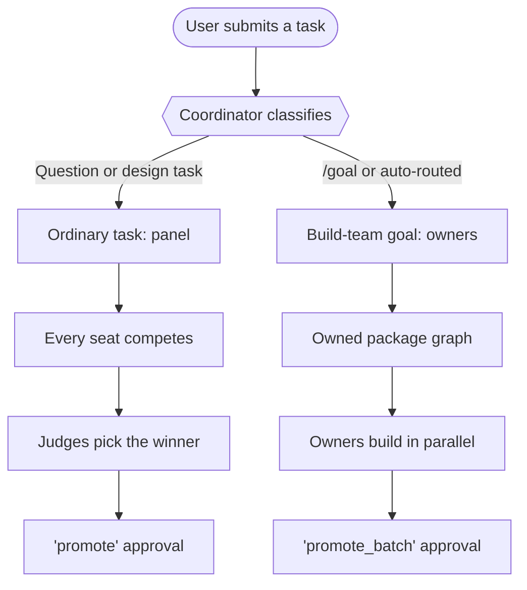
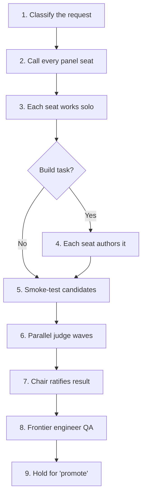
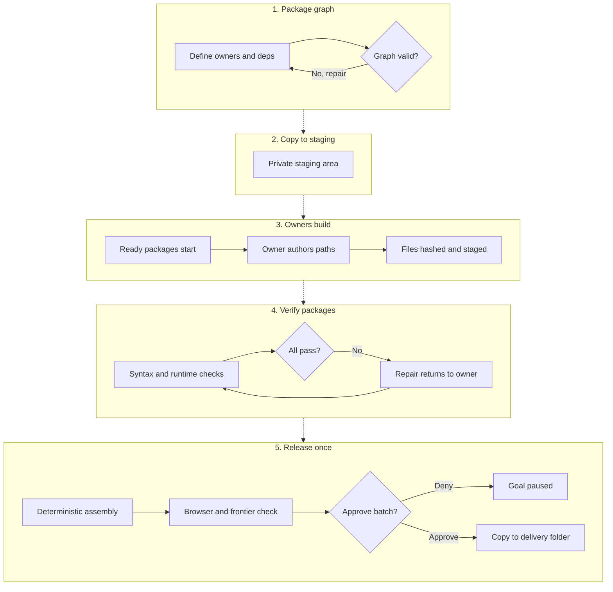

# Gang of 8


Gang of 8 is a local, human-governed coordinator for multiple LLMs. It can
convene the whole configured council to compare independent solutions, or turn
the same council into a build team whose members own different parts of a
larger job. The application runs the models, captures their work as real
artifacts, verifies it, keeps an audit trail, and requires approval before
moving finished work into a real project.

The name describes the intended full roster: one coordinator plus seven model
seats. The bundled roster can combine three local CLI seats (Claude, Codex, and
Gemini) with four optional OpenRouter seats (DeepSeek, GLM, Qwen, and Kimi).
Seats can be enabled, disabled, remapped, and model-pinned in Settings. The
dashboard header also exposes all seven brands as immediate checkboxes, so the
working roster can be changed without opening Settings. New runs snapshot the
enabled roster; disabling seats is the supported way to use a smaller council.

The repository ships a versioned portable settings profile. A fresh
installation uses it when no `settings.json` exists, and any installation can
export its current profile, import another one, or restore the packaged profile
from Settings. Profiles move council/model choices and preferences only; they
never contain API keys, workspaces, sandbox paths, or session data.

Gang of 8 is currently version `0.1.0` and under active development. It is a
single-user desktop service, not a hosted multi-tenant system.

## The two collaboration modes

Gang of 8 deliberately uses different logic for a normal request and a large
build goal.

| | Ordinary task | Build-team goal |
|---|---|---|
| Start it with | Any normal prompt | `/goal <objective>`, or a substantial build brief auto-routed from `/tasks` |
| Best for | Questions, research, reviews, designs, and bounded deliverables | Multi-file builds, overhauls, and long objectives |
| Council behavior | Every enabled seat produces an independent take or candidate | The architect creates owned work packages with dependencies |
| Model ownership | Competing whole solutions, followed by blind selection | One named model atomically authors each cohesive package; models run in parallel across packages |
| Concurrency | Panel calls, smoke checks, and judge waves run in parallel | Descriptive contract work may overlap; runtime consumers wait for accepted provider bytes |
| Integration | Blind best-of-N plus a strong finishing/chair pass | A hard-after QA owner inspects actual staging before deterministic assembly |
| Delivery | A governed `promote` action for the session | Browser/semantic acceptance, then one hash-bound diff and approval |

This distinction preserves the reason for using several models. A tournament
is useful when several independent answers improve selection. A build team is
useful when seven models should contribute seven different pieces instead of
rewriting the same file seven times.

### Routing at a glance



Substantial production briefs no longer depend on the user remembering the
`/goal` command. The dashboard and `POST /tasks` conservatively recognize long,
multi-surface implementation requests and return a goal response with
`auto_routed: true`. Short fixes, questions, attachment-driven work, and bounded
deliverables remain ordinary sessions.

Attached source code is classified from the user's directive, not from
incidental method names inside the attachment. Requests to fix, improve, or
return an attached implementation therefore enter the code workflow and its
authoring policy; genuine destructive directives remain governed actions.

For file-producing code, content, design, and explicit revision tasks, prose is
never accepted as proof of completion. Success requires an executed file write,
edit, or delivery action followed by artifact verification. If the owner fails
or every model returns a stub, the run terminates as `failed_verification` with
low confidence before a summarizer can claim that a missing file was delivered.
External actions such as send, delete, and deploy continue through their own
governance ledger rather than pretending to be file deliverables.

## Frontier implementation policy

Claude and Codex are treated as implementation capacity first and evaluation
capacity second when they are enabled:

- each must author a substantive source-producing package in a broad build-team
  goal; the coordinator repairs planner assignments that put them only on
  review or documentation;
- an ordinary code tournament requires a candidate from every enabled frontier
  author, and each required candidate must pass the runtime gate;
- a failed frontier candidate goes back to the same model for implementation
  repair before judging; returning later only as a judge does not satisfy the
  author quorum;
- frontier authoring and release verification have no coordinator hard deadline
  by default and remain immediately cancellable by the user;
- a selected implementation is checked against an explicit requirement list
  and judge-defect register by a different frontier release engineer; and
- a build team's assembled final batch receives the same independent frontier
  inspection before the single approval card is created. A failed inspection
  can apply surgical code repairs, but the repaired result must pass a second
  confirmation inspection.

Disabling Claude or Codex in the header or Settings intentionally removes that
seat from the required quorum. This is the supported way to request a smaller
council.

### Deterministic final assembly

A build-team package that combines accepted JavaScript and CSS into one HTML
deliverable declares `ASSEMBLY: HTML_INLINE` plus either an accepted template
path or `TEMPLATE: OWNER`. Accepted template paths are assembled with zero model
calls. `OWNER` permits one finite call that returns only a compact HTML skeleton
containing exact, standalone `GANGOF8:STYLE` and `GANGOF8:SCRIPT` directives.
Directives may not sit inside existing `<style>` or `<script>` elements because
each expands into a complete element of that kind. The coordinator
then verifies every dependency's accepted SHA-256 and expands every declared
source exactly once from staging.

Assembly uses no byte or character thresholds. Expanded source is never sent
through skill-result truncation, model context, or generic artifact repair.
Malformed, nested, missing, duplicate, undeclared, changed, non-UTF-8, or unsafe inline sources
fail the explicit assembly gate before delivery. The final assembled file is
then hash-checked and smoke-validated deterministically, exercised in a real
browser when interactive, and reviewed against the semantic acceptance list by
an independent frontier engineer. Assembly integrity is never treated as a
quality verdict.

## How an ordinary task works

An ordinary task uses the council as a panel:



1. The coordinator classifies the request and captures its source, output, and
   delivery context.
2. Every configured and available panel seat is called. There is no automatic
   four-seat cap and no latency-based benching.
3. Seats work independently so the first answer does not anchor the others.
   Discovery requests such as file reads, project searches, directory listings,
   and web lookups are resolved through the governed skill layer.
4. On a build task, each seat can author a complete namespaced candidate in the
   council workspace.
5. Candidate files are smoke-tested where supported. A required Claude/Codex
   failure returns to its author for code repair; it cannot be silently dropped.
6. Independent judges score anonymous candidates. Judges run in parallel waves;
   a unanimous first wave can stop the remaining judge calls early.
7. A strong codifier/chair ratifies or overrides the vote using evidence,
   closes every numbered judge defect, applies bounded surgical fixes, and can offer a separately validated
   integration candidate when Council integration review is enabled.
8. An independent frontier release engineer checks every extracted acceptance
   requirement, repairs failures when possible, and confirms repaired code in a
   second pass. Candidate counts report authored and runnable totals separately.
9. The chosen output remains in a council-controlled space until its governed
   delivery action is approved.

The panel roster is product intent, not a speed setting. Performance work is
therefore concentrated in concurrency, early stopping, reduced serial model
passes, and deterministic summaries. If a smaller panel is desired, disable
the unwanted seats in Settings before starting the run.

Ordinary deliberation proceeds automatically in bounded round blocks. If the
lead wants more rounds after the configured consent interval, the app asks
whether to continue, run a specific number of additional rounds, or compose
from the work already completed. Agent-call, wall-clock, delegation-depth, and
fan-out budgets remain hard limits.

## How a build-team goal works

Enter `/goal` in the dashboard composer for work that should be divided among
the council. For example:

```text
/goal Overhaul the application in C:\Projects\ExampleApp. Split the work into
owned frontend, backend, persistence, test, performance, and documentation
packages. Preserve current behavior and deliver the verified result back to
C:\Projects\ExampleApp.
```

New goals use `collaboration_mode=build_team` and
`delivery_mode=final_batch`.



### 1. The architect creates a package graph

The planner defines each package with:

- a unique package identifier and title;
- one enabled model owner;
- hard artifact dependencies and non-blocking interface dependencies;
- exclusive output paths;
- an explicit `RELEASE` subset that distinguishes user-facing deliverables
  from internal modules, build scripts, and QA evidence;
- required input files;
- an interface contract; and
- acceptance checks.

For a broad build, the planner creates only the natural package boundaries the
deliverable actually needs. A small job may reasonably need one package.
Package ownership and collaboration resources are separate: enabled models do
not receive artificial files merely to manufacture participation. The
configured code generator owns the primary source/release package when it is
available; other owners may take genuinely independent packages. Missing
owners are normalized across eligible owner seats, inferred file
dependencies are added, repeated output paths are sequenced, and cyclic hard
dependency plans are rejected. A hard `AFTER`/`REQUIRES` edge means verified
file bytes must exist before the owner can start. `CONTRACTS` remains
nonblocking only for descriptive work. HTML, CSS, and JavaScript consumers are
automatically promoted to hard dependencies and receive the exact accepted
provider bytes and SHA-256 hashes, so method names, time units, input semantics,
DOM hooks, and load order cannot drift behind matching prose.

If a generated package graph violates one of these deterministic contracts,
the coordinator sends the complete rejected plan and every exact validation
error back to the same architect for up to two constrained repair attempts.
Each attempt receives the full planning timeout. Packages start only after a
replacement graph passes the unchanged gate; repeated invalid plans pause with
no package sessions or partial output. Cancelling during a repair revokes the
planning lease and prevents later calls from resurrecting the goal. Set
`GANGOF8_GOAL_PLAN_REPAIR_ATTEMPTS` to change the default repair limit of `2`.

### 2. The source is copied into private staging

Each goal receives a persistent overlay at:

```text
data/goal-workspaces/<goal-id>/stage/
```

When an established source folder is known, it is copied into staging once.
Large generated or vendor trees such as `.git`, `node_modules`, virtual
environments, caches, `dist`, `build`, `vendor`, and `target` are skipped. The
real project remains read-only during package work.

An active workspace is used as the source when the goal text does not name a
project folder. Explicit source and delivery folders in the prompt take
precedence.

### 3. Owners build distinct pieces

Every package whose hard dependencies are satisfied is scheduled. A package
that only consumes another owner's declared interface can start immediately,
even while that provider is still working. Dashboard goals run in the
background, so a broad plan normally puts most or all enabled owners into its
first execution wave. Each package session remains accountable to its named
owner. Under Adaptive or Full Council participation, that owner first produces
a cohesive baseline and then every enabled collaboration resource receives the
actual baseline bytes with a deterministic review lens. Peers return
evidence-based findings and concrete `EDIT` patches. The owner must explicitly
accept, reject, or supersede each contribution and emits the integrated package
files in full.

Every output path in a package goes to its accountable owner in one cohesive
authoring call. Tightly coupled HTML, CSS, and JavaScript are never round-robin
mixed and then mislabeled as integrated. Independent packages run concurrently,
and each package's peer challenge wave fans out concurrently within the local
CLI and API resource limits. Existing-file revisions still use the owner and a
surgical edit path.

Each owner receives the package/interface sections, its exact output map, and
the actual hash-bound bytes of every hard dependency. A completed response that
misses an artifact envelope or exact path can receive one focused correction.
A timed-out or errored owner is not immediately repeated or replaced by a
mixture of sibling authors.

Artifact boundaries are explicit and path-exact:

```text
ARTIFACT: src/games/asteroids.js
<raw file bytes>
END_ARTIFACT
```

Only bytes inside that envelope become the file. Matching quote or Markdown
wrappers around a path are presentation syntax, not filename characters. A
package owner must use one of its exact contracted paths; a basename such as
`asteroids.js` cannot silently stand in for `src/games/asteroids.js`. Legacy
unfenced source replies receive a conservative cleanup pass for recognizable
trailing presentation headings, followed by the normal syntax gate.

Completed package files are hashed and accepted into shared staging. Hard
downstream owners read the actual verified bytes produced by upstream owners.
Runtime-linked owners wait for the accepted implementation and bind to its real
surface. A non-assembly integration/QA owner must sit after a broad runtime
graph; deterministic HTML assembly is concatenation, not integration.

When a standalone JavaScript package intentionally consumes an upstream
runtime that is still being built, Gang of 8 records its dynamic runtime check
as deferred instead of executing the module in a false empty environment.
Static checks and package acceptance checks still run immediately. The
assembled HTML/integration package remains responsible for the real end-to-end
runtime check.

### 4. Packages are verified before release

A package cannot complete when its planner contract is missing or malformed,
a required file is absent or empty, its own source does not parse, a dependency
changed unexpectedly, or an acceptance check fails. Per-file syntax,
acceptance commands, dependency compatibility, and runtime smoke checks are
separate evidence; one failure never suppresses the others. Static checks
recognized by the coordinator can run automatically. Functional test commands
remain separately approval-gated because they execute code.

`CHECK: NONE` is an explicit no-check declaration, not a shell command, and is
discarded both when a new plan is parsed and when an older persisted package is
verified. The deterministic HTML smoke harness supplies standard layout APIs
such as `ResizeObserver`, `IntersectionObserver`, `MutationObserver`, and the
CSS `style.setProperty()` surface so missing test doubles do not trigger an
expensive model rewrite. Key, pointer, timer, animation-frame, and load-handler
exceptions all fail the gate, including failures that occur only after input.

Cross-package runtime defects are attributed separately. If staged dependency
files conflict before the current package loads, the current owner is not asked
to rewrite unrelated code. Its independent syntax and acceptance checks still
run, and the incompatibility is carried to the frontier integration package,
which owns assembly-level reconciliation.

Validation and test repair loops are bounded. A failure is recorded honestly;
it does not become a successful milestone merely because the model stopped.
Deterministic cleanup runs before any model repair. A package repair returns to
the original owner and exact contracted path; a summarizer or validator does
not silently become the author. An unchanged repair is stopped rather than
spending another identical call. When a build package cannot recover, the goal
stops scheduling new work and enters `draining` while already-productive
siblings finish. It becomes `paused` only after every sibling is terminal, with
the staging directory intact for inspection and resume.

If deterministic final assembly proves that an accepted upstream HTML template
violated its directive structure, the failure is attributed to that template's
owning package. That exact upstream session is excluded from verified-work
recovery; the coordinator schedules the template package again before assembly
without another human checkpoint, while retaining all unrelated accepted
sibling packages. After a process restart, one Resume continues that repair.

### 5. The entire goal is released once

No package emits an incremental file-promotion approval, including promotions
suggested by a late repair or salvage response. After every package has passed,
Gang of 8 creates one release session containing only the planner's explicit
`RELEASE` manifest. Package `OUTPUTS` remain in staging unless they are also
named in `RELEASE`; this is how a single-file app releases `arcade.html` without
also moving its source modules, build scripts, and QA files. Deterministic
assembly first proves source integrity, then continues into real-browser and
independent frontier semantic acceptance. Interactive HTML fails closed when a
Chromium/Edge/Chrome acceptance run cannot be performed. The browser blocks
external requests, drives controls/keyboard/pointer input separately, sustains
runtime, captures page/console failures, and detects wholesale DOM/CSS selector
mismatches. If no destination
was provided, the app asks for one folder at this point. The dashboard then
shows one aggregate diff and two decisions:

- `Approve final batch`
- `Deny`

Approval is bound to the SHA-256 of every byte that passed the final gate.
Promotion rejects any staging drift after verification or approval, verifies
the prepared transaction copy, and verifies the destination after replacement.
Every destination file must also match the existence/hash baseline shown during
review. If a later replacement or hash check fails, Gang of 8 attempts to
restore the files already replaced.

This is a rollback-protected multi-file transaction, not a claim that a normal
filesystem can provide a truly atomic cross-file commit. Target drift, locked
files, permissions, and rollback failures are surfaced rather than hidden.

If the batch is denied, the goal is paused and its completed staging work is
retained. Resuming it creates a fresh release review. The user can also choose
to keep the final batch in staging instead of delivering it.

## Council roster and model configuration

**Right-sizing defaults** (see `ARCHITECTURE-REVIEW.md`): the roster serves
the task. By default the panel runs in **duo** mode — a lead author plus one
independent frontier reviewer — and goals are planned against a
frontier-only build roster with the fewest packages the deliverable's real
structure allows (a single-file deliverable is exactly one authoring
package). Build collaboration has a separate resource roster containing every
enabled registered model, including DeepSeek when no named specialist role
maps to it. Settings provides three participation modes:

- **Focused** — package owner plus independent release verification.
- **Adaptive** (default) — Full Council for standard/complex code builds and
  Focused behavior for small work.
- **Full Council** — every enabled resource is scheduled against the real
  baseline; failures remain visible rather than silently shrinking the roster.

Environment variables still control ordinary panels and owner eligibility:

- `GANGOF8_PANEL_MODE=council` — convene every configured seat, plus enabled
  OpenRouter seats, on ordinary tasks (default: `duo`).
- `GANGOF8_GOAL_FULL_ROSTER=1` — let enabled budget seats join build-team
  goals and allow multi-owner assembly of a single release artifact
  (default: frontier seats only, one owner per artifact).
- `GANGOF8_GOAL_MAX_MODEL_CALLS` — per-goal model-call budget (default
  `40`, `0` disables). A goal that reaches it pauses with a per-seat cost
  report; resuming grants another block. Spend shows on each goal card as
  `used/budget calls`.

An explicit panel roster chosen in Settings controls ordinary panel sessions;
it does not remove enabled models from a goal's collaboration resource roster.

The real `cli` backend can register these local seats when their commands are
installed and authenticated:

- `claude`
- `codex`
- `gemini`

Settings can additionally enable these OpenRouter seats when an OpenRouter API
key is present:

- `deepseek`
- `glm`
- `qwen`
- `kimi`

The default CLI role mapping is:

| Role | Default seat |
|---|---|
| Lead, architect, implementer, code generator, summarizer | Claude |
| Knowledge retriever, researcher, red team | Gemini |
| API integrator, critic, fact validator | Codex |

Role mapping and panel membership are separate concepts. A model may be a
panelist in the full council and also perform a specialist role in a different
call. Settings supports:

- enabling or disabling local CLI seats;
- enabling or disabling OpenRouter seats;
- choosing an explicit panel roster;
- pinning a model per seat;
- pinning a different model for a specific role;
- setting per-CLI-seat timeouts;
- changing the lead and specialist role mapping;
- changing complexity budgets and round-consent cadence;
- enabling or disabling Council integration review; and
- selecting Focused, Adaptive, or Full Council build participation.

The header lists the seven brands—OpenAI, Anthropic, Gemini, DeepSeek, GLM,
Qwen, and Kimi—with a checkbox beside each. Each switch saves immediately
through the same settings API. When a seat is disabled, its adapter is not
registered or invoked and all of its roles are redistributed round-robin across
the remaining enabled seats. A single enabled model therefore inherits the
entire role map. If every model is disabled, new task submission fails with a
clear prompt to enable at least one. OpenRouter seats still need an API key to
answer calls. Role-specific model pins remain attached to their originally
configured provider: an inherited Gemini role never receives a Claude, Codex,
or OpenRouter model identifier, and the original pin becomes active again if
that provider is re-enabled.

Backend and roster changes apply to new sessions. A running or paused session
keeps the backend, panel, timeouts, and workflow version with which it started.
Persisted goals created before the build-team overhaul keep their legacy
tournament/milestone semantics; start a new `/goal` to use owned packages and
final-batch delivery.

## Live observability and seat health

The dashboard streams the run instead of making you reconstruct it from
status pills (see `NEXT-LEVEL.md` for the design rationale):

- **Live activity feed** — a persistent pane fed by `GET /events/stream`
  (SSE). Every coordinator event appears the moment it happens — authoring
  progress, gates passing, fault attribution, package reopens, escalations,
  budget stops — with clickable rows that jump to the session.
- **Seat health badges** — the header shows each panel seat as
  🟢 healthy · 🟡 degraded (capacity/timeout — still schedulable) ·
  🔴 unavailable (quota exhausted, auth expired, or CLI offline), with the
  provider's own message on hover. Health is fed by every adapter call and
  *consulted by scheduling*: pending packages transfer away from a
  hard-unavailable owner before a session opens, escalation targets and the
  release-verifier pool skip dead seats, and a goal stopped by a seat outage
  says so plainly ("seat claude is unavailable (quota exhausted): monthly
  spend limit…") instead of surfacing a downstream symptom.
- **Plain-language "now" line** — every goal card states its current
  activity in one sentence: "claude authoring game.html (12,345 chars
  streamed)", "waiting for your release approval", "paused — budget
  reached".
- **Goal story (📜)** — one click renders the goal's complete ordered
  timeline merged from all of its sessions, topped by a postmortem: model
  calls per seat against the budget, packages with owners and invalidated
  attempts, and attempts split honestly into completed / lost to seat
  outages / interrupted / failed.
- **Output tail** — while a streaming seat is authoring, the session view
  shows the last few hundred characters the model is literally writing.

## Timeouts, failures, and recovery

The per-seat timeout shown in Settings is a routine/non-code guardrail and does
not cap any session classified as code. Code-authoring and package-recovery
calls have no coordinator wall-clock deadline by default: a productive model is
allowed to finish. Operators can opt into author/package deadlines with the
environment variables below. Frontier seats in coding sessions stay unlimited
at lead, judge, codifier, repair, and release-review stages too; stage limits
still apply to non-frontier seats. OpenRouter closes a request after 180 seconds
with no answer or reasoning tokens; transport comments and keep-alives do not
count as progress. Registered HTTP connections and CLI processes also stop
immediately when the user cancels the session or goal.

Gang of 8 handles failures as follows:

- an unavailable local Claude or Codex login is detected before a CLI-backed
  ordinary run and recorded as degraded council health;
- an ordinary non-frontier seat that hits a hard timeout is recorded as dropped;
- outside build-team packages, a frontier tournament author returning a stub or
  transient error is re-called as the same implementation owner; a missing or
  non-runnable required frontier candidate stops delivery instead of degrading
  silently;
- package authoring is not cut off by elapsed wall time unless an operator opts
  into `GANGOF8_PACKAGE_AUTHOR_DEADLINE`; an opted-in deadline includes queue
  time and is divided across author/recovery waves;
- a timeout/error is never retried against the same author. Only its unresolved
  exact paths may be reassigned once to a healthy sibling, which must author new
  artifacts during the recovery wave. Completed sibling outputs are
  preserved, and the original and delivering authors remain in the audit trail;
- a completed protocol/path miss can receive one focused exact-path correction;
  no assignment or timeout decision uses guessed file byte or token counts;
- deterministic assembly spends only its one compact-template call;
- streaming OpenRouter calls persist output-backed progress timestamps and
  distinguish productive generation from a silent/stalled request;
- bounded artifact and test repair loops re-run verification after changes,
  stay on the exact path, and return package code to its owner;
- exhausted recovery does not report success;
- cancellation immediately closes registered HTTP/CLI work, revokes the worker
  lease, clears persisted active calls, and records the session terminal, so a
  late background worker cannot overwrite newer authoritative state; and
- after a server restart, orphaned live sessions are cancelled and active goals
  are parked as paused rather than left permanently `running` with no worker.

Resume is available after draining completes. It first scans the audit store for a successful, already-verified attempt
from the same package owner. If its complete required manifest still exists,
Gang of 8 adopts those exact files into staging and marks the package complete
instead of paying the model to redo it. Failed packages are reset together,
healthy sibling package bindings are preserved, and every ready branch is
scheduled—not just the first package index. The goal epoch is preserved on
resume so a healthy sibling cannot be invalidated merely because another
package failed.

Restart recovery does not resume an interrupted model subprocess in place. It
parks every running package, not only the first one shown in the goal. Inspect
the recorded error and explicitly resume the paused goal; completed verified
work is then recovered as described above.

The dashboard groups retry sessions under their parent goal. Each package row
shows its accountable owner, exact-output author count, effective session
state, session attempt count, total model-call attempts, blockers, and active
model calls. The goal/session read-only APIs also expose the current
file-to-author map, append-only per-file author history, attempt counts, author
failures, optional deadline, package wall time, and aggregate elapsed time across
successful and failed model attempts. Streaming calls
report output characters and whether they are
waiting for first output; calls show either their hard deadline or "no hard
deadline", and streaming
providers also show the independent no-output limit. The goal card exposes the
`draining` state, aggregates approval/input blockers, and selects the actionable
session, so a cancelled goal cannot continue to look like an active
deliberation and a release approval is not hidden behind an arbitrary package.
Package-attempt history is retained in the goal API. Resume immediately selects
the new attempt; if a historical failed attempt is opened directly, it is
labelled historical and points to the running retry. Package briefs omit live
status words because their text is a start-time snapshot, while the goal card
and build-team roster always render the current authoritative package state.

The top of the dashboard's history rail includes **Del All** for clearing local
history. It opens one confirmation dialog with **No** and **Yes, delete all**;
no confirmation phrase must be typed. Confirming cancels any active sessions or
goals and permanently removes all session records, goal records, transcripts,
audit logs, and the visible activity feed. Generated project files and promoted
deliverables are not deleted.

## Workspaces, staging, and delivery boundaries

Gang of 8 uses several intentionally different file spaces:

| Space | Purpose | Direct model writes? | Human delivery approval? |
|---|---|---:|---:|
| Session sandbox | Disposable per-session scratch work | Yes | No |
| Active workspace | Registered council work area captured by new sessions | Yes | No |
| Goal staging | Persistent shared overlay for one build-team goal | Yes, through package ownership | No per-file approval |
| Established/delivery folder | The user's real project or requested output folder | No | Yes |

Paths are resolved inside their selected root. Attempts to escape a workspace
with absolute-path tricks or `..` traversal are rejected. An explicit “read
from A, save to B” request keeps the source and delivery roots separate, so a
source is not overwritten merely because it was read.

The active workspace can be selected in the dashboard or managed from the CLI:

```powershell
.\.venv\Scripts\python.exe cli.py workspace list
.\.venv\Scripts\python.exe cli.py workspace add my-project C:\Projects\MyProject
.\.venv\Scripts\python.exe cli.py workspace use WORKSPACE_ID
.\.venv\Scripts\python.exe cli.py workspace none
```

`workspace empty` deletes the contents of the active council workspace. It does
not empty an established delivery folder, but it is still destructive and
should be used carefully.

## Governed skills and approvals

Models do not receive unrestricted native shell or filesystem access. They
request named actions, which Gang of 8 validates and executes.

| Skill | Purpose | Approval behavior |
|---|---|---|
| `read_file` | Read from an allowed space | No approval |
| `search_project` | Search names and file contents | No approval |
| `list_dir` | List an allowed directory | No approval |
| `web_search`, `web_fetch` | Retrieve current public information | No approval |
| `write_file` | Write a file in a council space | No approval |
| `edit_file` | Replace a unique snippet in a council-space file | No approval |
| `run_tests` | Run bounded verification in a council space | Recognized static checks can auto-run; functional execution requires approval |
| `stage` | Move sandbox work into an active council workspace | No approval |
| `promote` | Copy an ordinary session artifact to the real destination | Approval required |
| `promote_batch` | Release a goal's complete verified manifest | One final-batch approval required |

An ordinary session can grant a standing approval for a category with
`approve_all`, avoiding repeated approvals of the same category in that
session. Build-team goals do not rely on standing per-file promotion approval;
they suppress intermediate promotions and create one `promote_batch` action.

## Installation

### Requirements

- Python 3.12 or later
- A modern browser
- Node.js only if you want JavaScript syntax checks during development
- For the real backend: one or more supported model CLIs installed on `PATH`
  and authenticated
- For optional API seats: an OpenRouter API key

Create a virtual environment and install the project:

```powershell
py -3.12 -m venv .venv
.\.venv\Scripts\python.exe -m pip install --upgrade pip
.\.venv\Scripts\python.exe -m pip install -e .
```

Install the development dependencies when working on the codebase:

```powershell
.\.venv\Scripts\python.exe -m pip install -e ".[dev]"
```

There is no separate `requirements.txt`; `pyproject.toml` is the dependency
source of truth.

## Starting and stopping the app

For real agents:

```powershell
.\.venv\Scripts\python.exe cli.py serve --backend cli
```

For a free, deterministic offline smoke run:

```powershell
.\.venv\Scripts\python.exe cli.py serve --backend mock
```

Then open [http://127.0.0.1:8790/](http://127.0.0.1:8790/).

Double-click (or double-click-equivalent) launchers are included for all
three platforms. All of them select the `cli` backend by default — edit the
`BACKEND` variable near the top of the script to switch to `mock` for a free,
offline run — and only one instance can hold port 8790 at a time:

- **Windows**: `Launch Gang of 8.bat` (visible server window) or
  `Launch Gang of 8 (no window).vbs` (hidden, opens the browser). Stop with
  `Stop Gang of 8.bat`.
- **macOS**: `Launch Gang of 8.command` (Terminal window) or
  `Launch Gang of 8 (no window).command` (detached, no window left open).
  Stop with `Stop Gang of 8.command`.
- **Linux**: `./launch-gangof8.sh` (foreground) or
  `./launch-gangof8-background.sh` (detached). Stop with
  `./stop-gangof8.sh`. Run these from a terminal — most file managers don't
  execute `.sh` files on double-click by default.

Launching while an instance is already running opens the existing dashboard
instead of starting a duplicate — a second `Service` would otherwise run its
crash-recovery step against the same data and could park an in-flight
goal/session the real instance is still actively working on.

Check the running service without opening the dashboard:

```powershell
Invoke-RestMethod http://127.0.0.1:8790/health
Invoke-RestMethod http://127.0.0.1:8790/diagnostics
```

The default programmatic backend is `mock` unless `--backend`, persisted
Settings, or `GANGOF8_BACKEND` selects `cli`. The launcher scripts above
explicitly select `cli`.

## First-run checklist

1. Open Settings and select the `cli` backend.
2. Confirm Claude, Codex, and Gemini availability. Install/authenticate any
   missing local CLI you intend to use.
3. Add an OpenRouter key and enable the four optional API seats if you want the
   full seven-model council.
4. Review model pins, role assignments, and per-seat timeouts.
5. Register an active workspace if you want new tasks/goals to use a default
   project folder.
6. Start with an ordinary question to verify the council, then use `/goal` for
   work that should be decomposed into owned packages.

The Settings page shows the effective seat/model catalog. Its model list is
refreshed from the public OpenRouter catalog with an offline fallback; Gemini's
catalog can also use its configured API key.

## Attachments and conversation follow-ups

The dashboard accepts text, PDF, and image attachments. Uploads are stored
locally and their extracted text or image references are folded into the task.
After a session finishes, a follow-up continues the same conversation with the
prior user/council turns as context. A follow-up is another deliberation, not an
unlogged mutation of the earlier result.

## CLI reference

The CLI supports ordinary sessions and workspace administration. Build-team
goals are currently started through the dashboard or HTTP API.

```text
python cli.py submit <text> [--source NAME] [--backend mock|cli]
python cli.py serve [--host 127.0.0.1] [--port 8790] [--backend mock|cli]
                    [--allow-remote]
python cli.py list
python cli.py status <session-id>
python cli.py log <session-id>
python cli.py pending
python cli.py approve <session-id> <approval-id> [--by NAME] [--all]
python cli.py deny <session-id> <approval-id> [--by NAME]
python cli.py inputs
python cli.py answer <session-id> <input-id> <text...> [--by NAME]
python cli.py decline <session-id> <input-id> [--by NAME]
python cli.py workspace list
python cli.py workspace add <name> <root>
python cli.py workspace use <workspace-id>
python cli.py workspace none
python cli.py workspace empty
```

Examples:

```powershell
.\.venv\Scripts\python.exe cli.py submit "Review this architecture" --backend cli
.\.venv\Scripts\python.exe cli.py pending
.\.venv\Scripts\python.exe cli.py status s_20260713_ab12cd34
.\.venv\Scripts\python.exe cli.py log s_20260713_ab12cd34
```

## HTTP API

The dashboard uses the same FastAPI surface available to local automation.
OpenAPI documentation is available at
[http://127.0.0.1:8790/docs](http://127.0.0.1:8790/docs) while the app is
running.

### Core routes

| Method and route | Purpose |
|---|---|
| `GET /health` | Process health, version, and active backend |
| `GET /diagnostics` | Redacted runtime and seat diagnostics |
| `POST /tasks` | Submit a task; substantial unattached build briefs may return an auto-routed goal (`kind: goal`, `auto_routed: true`) |
| `POST /uploads` | Store a base64 attachment and return its upload ID |
| `GET /sessions` | List sessions |
| `GET /sessions/{id}` | Full persisted session, health, and run summary |
| `GET /sessions/{id}/timeline` | Readable event timeline |
| `GET /goals/{id}/timeline` | The whole goal's ordered story plus a derived postmortem (spend per seat, attempts split into completed / seat-outage / interrupted) |
| `GET /seats` | Live per-seat health: state, reason, since — fed by every adapter call's outcome |
| `GET /events/stream` | Server-Sent Events: every coordinator event as it happens, rendered through the human-readable vocabulary (the dashboard's live feed) |
| `DELETE /history` | Cancel active work and permanently delete all session, goal, transcript, and audit-log history; requires the dashboard's guarded confirmation payload |
| `POST /sessions/{id}/followup` | Continue a completed conversation |
| `POST /sessions/{id}/cancel` | Cancel a live session |
| `POST /sessions/{id}/approvals/{approval_id}` | Approve or deny an action |
| `POST /sessions/{id}/inputs/{input_id}` | Answer or decline a question |
| `GET /approvals` | List pending approvals |
| `GET /inputs` | List pending questions |
| `POST /goals` | Create and optionally background a build-team goal |
| `GET /goals`, `GET /goals/{id}` | List or inspect goals, including aggregate blockers, active calls, attempts, and the actionable session |
| `POST /goals/{id}/resume` | Resume a paused goal |
| `POST /goals/{id}/cancel` | Cancel a goal |
| `GET /settings`, `PUT /settings` | Read or patch persisted settings |
| `GET /settings/seats` | Inspect seat and model availability |
| `GET /settings/profile` | Export the current versioned, non-secret portable profile |
| `POST /settings/profile` | Validate and load a portable profile |
| `POST /settings/profile/default` | Load the packaged `default-settings.json` profile |
| `PUT /settings/api-keys/{name}` | Store `openrouter` or `gemini` locally |
| `GET /workspaces`, `POST /workspaces` | List or register workspaces |
| `PUT /workspaces/active` | Select or clear the active workspace |

### Submit and poll an ordinary task

```powershell
$body = @{
  text = "Assess the current application architecture"
  source = "automation"
  background = $true
} | ConvertTo-Json

$request = @{
  Method = "Post"
  Uri = "http://127.0.0.1:8790/tasks"
  ContentType = "application/json"
  Body = $body
}
$run = Invoke-RestMethod @request

Invoke-RestMethod "http://127.0.0.1:8790/sessions/$($run.session_id)"
```

### Start and poll a build-team goal

```powershell
$body = @{
  text = "Overhaul C:\Projects\ExampleApp and deliver the verified files there"
  background = $true
} | ConvertTo-Json

$request = @{
  Method = "Post"
  Uri = "http://127.0.0.1:8790/goals"
  ContentType = "application/json"
  Body = $body
}
$goal = Invoke-RestMethod @request

Invoke-RestMethod "http://127.0.0.1:8790/goals/$($goal.goal_id)"
```

### Resolve the final batch approval

The goal record exposes `release_session_id`. Fetch that session, select its
pending approval, and resolve it:

```powershell
$session = Invoke-RestMethod -Uri "http://127.0.0.1:8790/sessions/$($goal.release_session_id)"
$approval = $session.approvals | Where-Object status -eq "pending" | Select-Object -First 1

$decision = @{ approved = $true; by = "automation"; background = $true } |
  ConvertTo-Json

$request = @{
  Method = "Post"
  Uri = "http://127.0.0.1:8790/sessions/$($session.session_id)/approvals/$($approval.approval_id)"
  ContentType = "application/json"
  Body = $decision
}
Invoke-RestMethod @request
```

## Configuration and environment variables

Editable non-secret settings are stored in `data/settings.json`. When that file
does not yet exist on a normal application start, Gang of 8 loads the packaged
`gangof8/default-settings.json` profile as the new-install baseline. Persisted
settings replace that baseline thereafter. An explicit backend argument (the
CLI and launcher set this from `GANGOF8_BACKEND`) still takes precedence for
the running service. API-key environment variables always override locally
stored keys.

### Portable settings profiles

Open **Settings → Portable settings profile** to use the three profile actions:

- **Export saved profile** downloads `gangof8-settings-profile.json` from the
  currently persisted settings.
- **Import profile…** validates and loads a profile from another installation.
- **Load packaged defaults** restores the versioned profile shipped with this
  build.

A profile includes:

- the backend, enabled local CLI seats, their selected models, and routine
  timeout preferences;
- enabled OpenRouter seats and exact model slugs;
- the explicit panel roster, full role-to-seat mapping, and per-role model
  pins;
- budget overrides, risk boundary, composer controls, consent-round interval,
  and the council integration-review preference; and
- dashboard polling and finished-section collapse preferences.

A profile explicitly cannot include API keys or other secrets, registered or
active workspaces, sandbox/delivery/source paths, uploads, sessions, goals, or
other installation state. Unknown fields are rejected during import instead of
being silently accepted. Loading is transactional: an invalid runtime mapping
does not overwrite the previous `settings.json`.

The sandbox is intentionally installation-specific. Unless
`GANGOF8_SANDBOX` is explicitly set for that machine, each install derives it
from the operating system: `%LOCALAPPDATA%\GangOf8\sandbox` on Windows and a
Gang of 8 subdirectory under the system temporary directory elsewhere.

The same workflow is available through the API. For example:

```powershell
# Export
Invoke-RestMethod http://127.0.0.1:8790/settings/profile |
  ConvertTo-Json -Depth 20 |
  Set-Content -Encoding utf8 gangof8-settings-profile.json

# Import
$profile = Get-Content -Raw gangof8-settings-profile.json
Invoke-RestMethod -Method Post `
  -Uri http://127.0.0.1:8790/settings/profile `
  -ContentType application/json -Body $profile

# Restore the profile bundled with this build
Invoke-RestMethod -Method Post `
  -Uri http://127.0.0.1:8790/settings/profile/default
```

Common environment variables:

| Variable | Purpose | Default |
|---|---|---|
| `GANGOF8_BACKEND` | `mock` or `cli` | `mock` |
| `GANGOF8_DATA` | Persistent application-data directory | Repository `data/` |
| `GANGOF8_SANDBOX` | Per-session scratch root | `%LOCALAPPDATA%\GangOf8\sandbox` on Windows |
| `GANGOF8_SANDBOX_KEEP` | Recent inactive sandboxes retained | `25` |
| `GANGOF8_MAX_PARALLEL_AGENTS` | Concurrent local CLI subprocesses | `4` |
| `GANGOF8_MAX_PARALLEL_API_AGENTS` | Concurrent API-backed calls | `8` |
| `GANGOF8_PANEL_AUTHOR_TIMEOUT` | Optional package/panel authoring hard deadline; `0` disables | `0` |
| `GANGOF8_PANEL_RETRY_TIMEOUT` | Optional focused recovery hard deadline; `0` disables | `0` |
| `GANGOF8_FRONTIER_AUTHOR_SEATS` | Comma-separated required implementation seats | `claude,codex` |
| `GANGOF8_FRONTIER_AUTHOR_TIMEOUT` | Optional frontier-author hard deadline; `0` disables | `0` |
| `GANGOF8_PACKAGE_AUTHOR_DEADLINE` | Optional shared package deadline; `0` disables, positive values are split across author/recovery waves | `0` |
| `GANGOF8_FRONTIER_AUTHOR_RECOVERY_ATTEMPTS` | Same-owner recovery calls for non-build-team frontier tournament authors | `1` |
| `GANGOF8_FRONTIER_VERIFY_TIMEOUT` | Optional independent frontier release deadline; `0` disables | `0` |
| `GANGOF8_FRONTIER_VERIFY_ATTEMPTS` | Initial inspection plus repair-confirmation ceiling | `2` |
| `GANGOF8_OPENROUTER_OUTPUT_STALL_TIMEOUT` | Independent no-model-output stall deadline, seconds | `180` |
| `GANGOF8_CODIFIER_TIMEOUT` | Strong finishing pass timeout, seconds | `600` |
| `GANGOF8_JUDGE_TIMEOUT` | Candidate judge timeout, seconds | `480` |
| `GANGOF8_MAX_JUDGES` | Maximum blind judges | `3` |
| `GANGOF8_JUDGE_FIRST_WAVE` | Judges called before early-stop evaluation | `2` |
| `GANGOF8_BATCH_PROMOTE_DIFF_MAX_CHARS` | Aggregate final-batch diff display cap | `60000` |
| `GANGOF8_ALLOW_REMOTE` | Explicitly allow non-loopback serving | unset |
| `OPENROUTER_API_KEY` | OpenRouter key; overrides stored key | unset |
| `GEMINI_API_KEY`, `GOOGLE_API_KEY` | Gemini key; override stored key | unset |

Additional tuning defaults live in `gangof8/config.py`. Prefer the Settings UI
for routine seat, model, role, timeout, budget, and interface configuration.

## Data and audit trail

With the default `GANGOF8_DATA`, persistent state lives under `data/`:

```text
data/
  gangof8.db                 SQLite session and goal state (WAL mode)
  sessions/<session>.jsonl   Append-only event trail per session
  settings.json              Non-secret editable settings
  secrets.json               Locally stored API keys
  workspaces.json            Registered workspaces and active selection
  uploads/                   Uploaded source material
  goal-workspaces/<goal>/    Persistent shared goal staging
```

`secrets.json` is a local convenience store, not an operating-system vault.
Keep the data directory private. Environment variables are preferable for
managed or automated environments.

Session and goal worker leases protect persisted state from stale background
threads. JSONL logs record model calls, contributions, drops, skill requests,
approvals, input requests, candidate selection, goal transitions, cancellation,
and recovery events.

## Local-only security model

The service can browse local folders, reveal locally stored keys, and ask the
operating system to open delivered files. It therefore binds to loopback by
default and rejects non-local requests.

Binding to a non-loopback host requires both `--allow-remote` and
`GANGOF8_ALLOW_REMOTE=1`. Only do this behind authenticated access. Even when
remote serving is enabled, revealing a key and opening a local file still
require a loopback request. The API itself does not add user authentication.

## Performance design

Gang of 8 reduces wall-clock time without silently shrinking the configured
council:

- local CLI and API calls have separate concurrency limits;
- ordinary panel seats fan out concurrently;
- sibling specialist delegations fan out concurrently;
- candidate smoke checks run concurrently;
- blind judging uses parallel waves with a unanimous early stop;
- build artifacts use deterministic summaries instead of another model call
  where possible;
- existing-file revisions use compact surgical edits rather than seven full
  rewrites;
- build-team goals eliminate duplicate whole-solution candidate generation;
- multi-output packages fan exact paths across enabled authors concurrently,
  with semantic package-only prompts and no response-size heuristics;
- all hard-dependency-ready work packages run concurrently;
- contract-linked modules defer only their premature standalone runtime probe,
  while integration owns the assembled runtime check;
- explicit release manifests keep internal staging files out of delivery; and
- quoted/backticked protocol filenames are canonicalized at parse and execution
  boundaries, preventing presentation punctuation from becoming path bytes;
- semantic release checks run only once after deterministic selection or final
  package assembly, preserving author parallelism; and
- source staging skips generated/vendor trees that add copy time but not useful
  implementation context.

The service background worker pool is wider than the provider limits so a
waiting goal package does not block unrelated ready work. Provider-specific
semaphores remain the actual resource controls.

## Troubleshooting

### I only see four council members

Inspect the seven checkboxes in the dashboard header, or open Settings for model
details. An OpenRouter seat needs both an API key and its enabled toggle. A
disabled or unavailable seat will not appear in a new run, and disabled role
holders are reassigned to enabled models. Roster changes do not alter a session
that has already started.

For an ordinary task, every configured available seat should be convened. For
a `/goal`, the center session has one accountable package owner by design. The
Build team card shows every package, owner, state, hard blocker, and non-blocking
contract link. Several package sessions should show `running` together when the
graph permits it.

### Claude timed out after reading a file

Start a new session after updating/restarting the app. New Claude/Codex author
and release-verifier calls have no coordinator hard deadline by default. A
positive environment override can opt into a limit. User cancellation still
terminates an in-flight CLI process immediately.

### I am being asked to approve every output file

Use a new `/goal` for a multi-file build. Current build-team goals stage package
outputs without promotion and present one final batch approval. Ordinary
sessions still use their own governed `promote` action, and legacy goals retain
the delivery semantics with which they were created. Functional code execution
can still require a separate safety approval even when file promotion is
batched.

### A goal is paused after a restart

This is intentional recovery behavior. The old model subprocess no longer
exists, so the service parks the goal rather than pretending it is still
running. Read `last_error`, inspect completed package/staging state, and use
Resume.

### A final batch fails because the target changed

The destination no longer matches the baseline reviewed in the aggregate diff.
Inspect the external changes, reconcile them with staging, and resume to create
a fresh review. The app will not overwrite drift silently.

### The dashboard will not start

Check whether port 8790 is already occupied, then run:

```powershell
Get-NetTCPConnection -LocalPort 8790 -ErrorAction SilentlyContinue
.\.venv\Scripts\python.exe cli.py serve --backend cli
```

Use `/health` and `/diagnostics` to distinguish a server problem from a missing
or unauthenticated model CLI.

## Development and verification

Run the local checks from the repository root:

```powershell
.\.venv\Scripts\python.exe -m ruff check gangof8 tests
.\.venv\Scripts\python.exe -m pytest tests -q
node --check gangof8\static\dashboard-utils.js
node --check gangof8\static\app.js
```

The current suite covers orchestration, governance, workspaces, settings,
uploads, cancellation, panel access, best-of-N selection, artifact validation,
test repair, throughput, hard versus contract-only package scheduling,
final-batch approval, destination drift, rollback, and restart/lease recovery.
The most recent full local verification count is reported with each completed
change.

## Repository map

```text
cli.py                         Command-line entry point
gangof8/main.py                FastAPI service and dashboard routes
gangof8/service.py             Service wiring, background work, goals, recovery
gangof8/loop.py                Deliberation, delegation, selection, repair
gangof8/goals.py               Goal planning, persistence, package contracts
gangof8/skills.py              Governed file/web/test/delivery operations
gangof8/governance.py          Approval policy and action authorization
gangof8/models.py              Persisted domain models
gangof8/settings.py            Settings/profile schema, persistence, migration
gangof8/default-settings.json  Portable new-install/default council profile
gangof8/logstore.py            SQLite sessions and JSONL audit logs
gangof8/adapters/              Mock, local CLI, and OpenRouter adapters
gangof8/static/                Dashboard HTML, CSS, JavaScript, and images
tests/                         Automated test suite
scripts/                       Session/contribution inspection helpers
ARCHITECTURE.md                System architecture notes
DESIGN.md                      Product and protocol design
DEVELOPMENT.md                 Short contributor setup guide
```

## Known boundaries

- Multi-model output is not automatically correct. The audit trail, execution
  checks, dissent, and approval gates make errors more visible; they do not
  remove the need for human judgment.
- External CLIs and APIs can fail, hang, rate-limit, change model identifiers,
  or require renewed authentication.
- A timed-out ordinary non-frontier panel seat is not silently replaced with an
  unconfigured model. A required frontier author cannot be bypassed at all.
- A build-team goal is only as good as its package decomposition, contracts,
  and acceptance checks. Review the generated package graph on important work.
- Rollback protection cannot guarantee atomic replacement across multiple
  ordinary filesystem files.
- Functional test execution remains approval-gated and time/output bounded.
- Old persisted goals are not automatically migrated into a different workflow
  halfway through execution.

For deeper implementation context, see [ARCHITECTURE.md](ARCHITECTURE.md),
[DESIGN.md](DESIGN.md), and [DEVELOPMENT.md](DEVELOPMENT.md).

## Copyright

Copyright © 2026 DigitalGods. All rights reserved.
